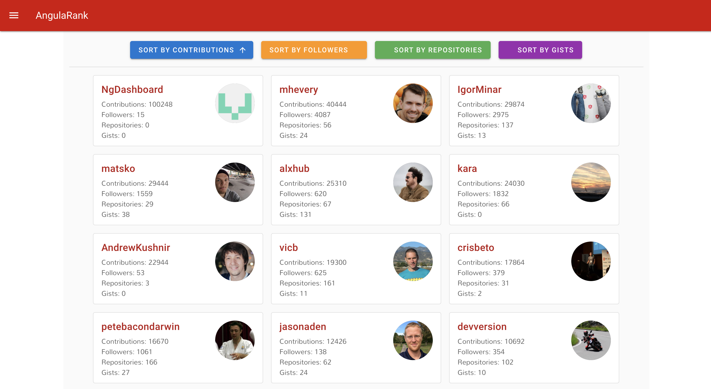
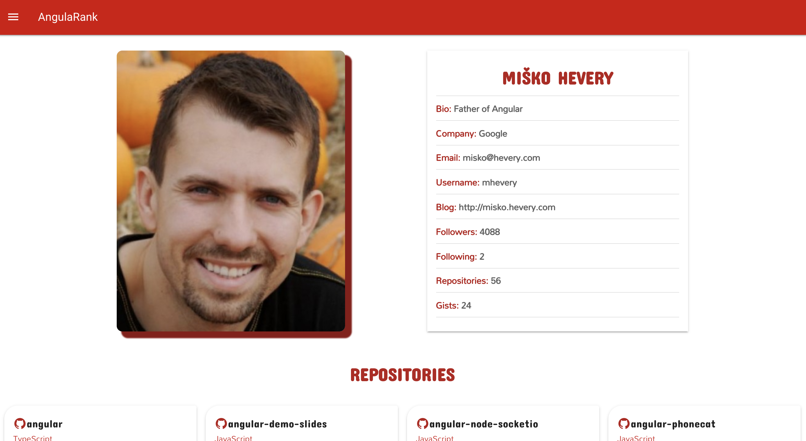
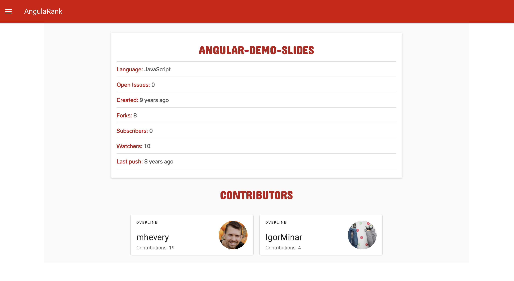

## AngularRank Challenge

 

Link to Pivotal Tracker: https://www.pivotaltracker.com/n/projects/2442904

Link to application: https://angular-rank.netlify.com

## Built With

<ul>
<li><a href="https://vuejs.org">Vue</a></li>
<li><a href="vuetifyjs.com">Vuetify</a></li>
<li><a href="https://api.github.com">Github API</a></li>
</ul>

## Testing Tools

<ul>
<li><a href="https://jestjs.io/">Jest</a></li>
<li><a href="https://airbnb.io/enzyme/">Enzyme</a></li>
</ul>

## Getting Started

<h3>Prerequisites</h3>
You need Nodejs Installed to be able to run this project on your machine.

<h3>Installing<h3>
<ul><li>Clone Repository</li></ul>
<pre><code>git clone https://bitbucket.org/easybuoy/angularank.git</code> </pre>
 
 

<ul><li>Change directory to Swapi Challenge</li></ul>
<pre><code>cd angularank</code></pre>
 
 

<ul><li>Install Dependencies</li></ul>
<pre><code>npm install</code></pre>
 
 

<ul><li>Start Application</li></ul>
<pre><code>npm run serve</code></pre>
 
 

<ul><li>Run Test</li></ul>
<pre><code>npm run test:unit</code></pre>
 
 

<ul><li>Run Linter</li></ul>
<pre><code>npm run lint</code></pre>
 
 